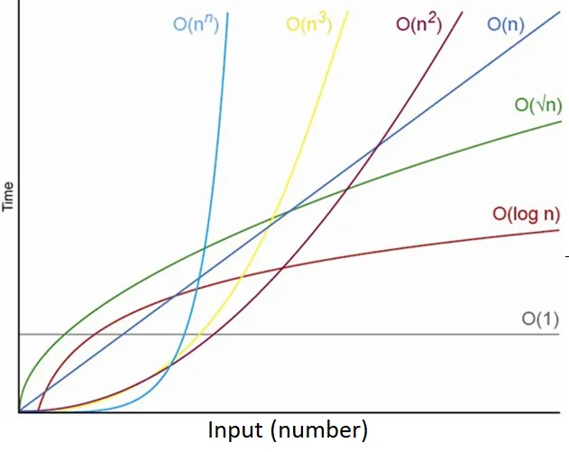

# Data Structures and Algorithms

## The Steps you need to create an algorithm

1. Define the problem statement
2. check the input and the expected output
3. The steps in the algorithm need to be in a very specific order
4. The steps also need to be distint
5. The algorithm should produce a result
6. The algorithm should complete in a finite amount of time

## Algorithms Creation Process

An algorithm is a set of steps that solves the problem statement.
An algorithm defination must contain a specific set of instructions in a particular order.
So basically an algorithm is a clearly defined problem statement, input and output.

1. The problem must have a clear problem statement
2. How the input is defined and the expected output
3. The algorithm must contain a specific order
4. You shouldmnt be able to break a step in an algorithm in far statement...it should be simple and precise
5. An algorithm should produce a result
6. The algorithm should not be infinite it should end at some point

## Algorithm Efficiency

Time Space Complexity:
To measure the efficiency of an algorithm you need to consider space and time.
Time Complexity is how long it takes an algorithm to run
Space Complexity is the amount of memory taken by the computer to compute your algorithm.
The running time of an algortihm is the number of times an algorithm has to run to complete a dataset.
To check the running time of an algorithm always use the worst case scenario.

## Big O notation

Big O notation is the theoritical defination of the complexity of an algorithm as a function of the size.
Big O is a notation used to describe complexity. it basically simplifies time and space compexity to a single variable.

O(n):
O-> Order of magnitude of complexity.
n-> a function of the size.
O(n)-> therefore this measures the complexity of an algorthim as the data grows.

The time complexity of a linear search is O(n).
The time complexity of a binary search is O(log n).

Each step in an algorithm has its own space time complexity
Logarithmic runtime is O(log n).

## Big O notation space time complexies

1. Polynomial Runtimes

Algorithms with polynomial runtimes are those whose running time is bounded by a polynomial function of the input size. These algorithms are generally considered efficient and practical for a wide range of problem sizes. Here are a few examples of algorithms with polynomial runtimes:

    1. Linear Search: Searching for a specific element in an unsorted list has a runtime of O(n), where n is the size of the list. The algorithm sequentially checks each element until a match is found or the end of the list is reached.

    2. Bubble Sort: Bubble sort is a simple sorting algorithm that repeatedly swaps adjacent elements if they are in the wrong order. The worst-case runtime is O(n^2) for an array of size n, making it less efficient for large input sizes. However, it has a best-case runtime of O(n) when the input is already sorted.

    3. Binary Search: Binary search is an efficient search algorithm for sorted lists or arrays. It repeatedly divides the search space in half by comparing the target element with the middle element. The runtime is O(log n), where n is the size of the sorted input.

    4. Insertion Sort: Insertion sort is a simple sorting algorithm that builds the final sorted array one element at a time. It has a worst-case runtime of O(n^2) but performs well for small input sizes or partially sorted lists.

    5. Dijkstra's Algorithm: Dijkstra's algorithm is used to find the shortest path in a weighted graph from a source vertex to all other vertices. The runtime is O((V + E) log V), where V is the number of vertices and E is the number of edges.

    6. Polynomial multiplication: Multiplying two polynomials of degree n using the naive approach has a runtime of O(n^2). However, more efficient algorithms like the Karatsuba algorithm or Fast Fourier Transform (FFT) can achieve a runtime of O(n log n).

Polynomial runtimes are generally desirable because they allow algorithms to scale well with larger inputs. However, it's important to note that the polynomial notation hides constant factors and lower-order terms, which can still have a significant impact on the actual runtime. Additionally, there are problems for which no known polynomial-time algorithm exists (e.g., NP-complete problems), and for those, approximation algorithms or heuristics are often employed.

    1. O(1)-> constant runtime
    2. O(n)-> linear runtime
    3. O(log n)-> logarithmic runtime
    4. O(n^2) ->Quadratic runtime
    5. O(n^3)-> Cubic runtime
    6. O(n log n)-> Quasilinear runtime (n * log n)-> this is mostly found in sorting algorithms

1. Exponetial Runtimes

Algorithms with exponential runtimes are those whose running time grows exponentially with the size of the input. These algorithms are generally considered to be inefficient for large input sizes and can quickly become computationally infeasible. Here are a few examples of algorithms with exponential runtimes:

    1. Brute Force: The brute force algorithm exhaustively checks all possible solutions to a problem by systematically trying each one. For problems with a large solution space, the running time can be exponential. For example, finding all subsets of a set with n elements has a runtime of O(2^n).

    2. Traveling Salesman Problem (TSP): The TSP is a well-known combinatorial optimization problem where the goal is to find the shortest possible route that visits a set of cities and returns to the starting city. The brute force approach to solve TSP has a runtime of O(n!), which grows exponentially with the number of cities.

    3. Knapsack Problem: The knapsack problem involves selecting a subset of items with maximum value, given a weight constraint. The brute force solution explores all possible subsets of items, resulting in a runtime of O(2^n), where n is the number of items.

    4. Subset Sum Problem: Given a set of integers and a target sum, the subset sum problem aims to determine if there exists a subset of the integers that adds up to the target sum. The brute force solution has a runtime of O(2^n) as it checks all possible subsets.

    5. Graph Coloring Problem: The graph coloring problem involves assigning colors to the vertices of a graph such that no two adjacent vertices have the same color. The brute force solution explores all possible color assignments, resulting in a runtime of O(k^n), where k is the number of colors and n is the number of vertices.

## How to Calculate the complexity of an algorithm

1. Binary Search algorithm
    i. Determine the middle position of the sorted list-> O(1)
    ii. Compare the element in the middle position to the target element-> O(1)
    iii. If the elements match we return the middle position and end->O(1)
    iv. If the elements dont match we check whether the element in the middle position is smaller or larger than the target element. If it is we go back to step 3 with the new list and repeat the process until you find it or it returns a subset with a single value-> O(log n)

When evaluating the runtime of an algorithm we say that the algorithm has as its upper bound the same runtime as the least efficient step in the algorithm. Therefore considering all of the steps required to perform a binary search the least effiecient  step is a O(log n). Therefore the time complexity of the algorithm is O(log n).

## Logarithms

Let's say you have the number 10 and want to know what power you need to raise another number, like 2, to get 10. The power you're looking for is called the logarithm.

So, in this case, the logarithm of 10 to the base 2 would tell you that 2 raised to what power equals 10. It turns out that 2 raised to the power of 3 (2³) equals 8, which is less than 10. But if you raise 2 to the power of 4 (2⁴), you get 16, which is more than 10. So, the logarithm of 10 to the base 2 is between 3 and 4. We can use decimal numbers to get a more precise answer, like 3.3219.

Logarithms are useful because they help us solve equations where we have an unknown exponent. For example, if we have the equation 2 raised to what power equals 8, we can rewrite it as log₂(8) = 3. So, the logarithm helps us find the missing exponent.

The logarithm function is typically written as "log" followed by a subscript that indicates the base of the logarithm. For example, if we have a base 10 logarithm, it is denoted as "log₁₀," and if we have a base e logarithm (where e is Euler's number, approximately equal to 2.71828), it is denoted as "ln" (natural logarithm).

The logarithm of a number, denoted as logₐ(b), is defined as the exponent to which the base (a) must be raised to obtain the number (b). Mathematically, it can be represented as:

b = a^logₐ(b)

Here are a few important properties of logarithms:

1. The logarithm of 1 to any base is always 0: logₐ(1) = 0.
2. The logarithm of a number to its own base is always 1: logₐ(a) = 1.
3. The logarithm of any base to itself is always 1: logₐ(a) = 1.
4. Logarithms can be used to solve exponential equations. For example, if we have the equation a^x = b, we can rewrite it as x = logₐ(b).

## linear search algorithm

Linear search does not require the data to be sorted

1. Start at the beginning
2. Move Sequentially
3. Compare current value to target
4. Reach end of list

## binary search algorithm

Binary search requires the data to be sorted

1. Determine the middle position of the sorted list
2. Compare the element in the middle position to the target element
3. If the elements match we return the middle position and end
4. If the elements dont match we check whether the element in the middle position is smaller or larger than the target element. If it is we go back to step 3 with the new list and repeat the process until you find it or it returns a subset with a single value

## DATA STRUCTURES

In simple terms a data structure is a way of storing data when programming.

A data structure is a data storage format. It is the collection of values and the format they are stored in, the relationships between the values in the collection as well as the operations applied on the data stored in the structure.

The most common data structure operations include:

1. accessing a value
2. inserting a value
3. deleting a value
4. searching for a value

Why do we build custom data structures?
we build custom data structures because each data structure solves a particular problem
for example an array is pretty good at accessing values but performs pretty bad in searching, inserting and deleting so we build custom data strutures to solve each of the above problems

## LINKED LIST

A linked list is a linear data structure where each element in the list is contained in a seperate object called a node. A node models two pieces of information the value and the address/reference of the next node in the list
The first node in a linked list is called the head and the last element in the linked list is called the tail of the linked list
The head and the tail of the linked list are special. Mostly a linked list maintains the poisiton/address of the head and sometimes both the head and the tail
Each node points to the next item of the linked list but the tail points to null to indicate the end of the linked list
There are two types of linked lists:

1. Singly Linked List -> a node only stores the pointer to the next node
2. Doubly linked list-> a node store the pointer to both the next and the previous node
